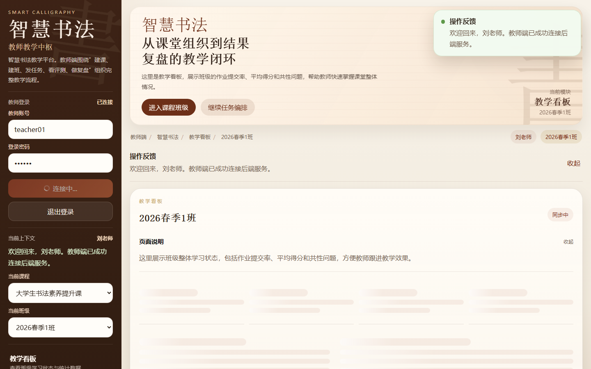
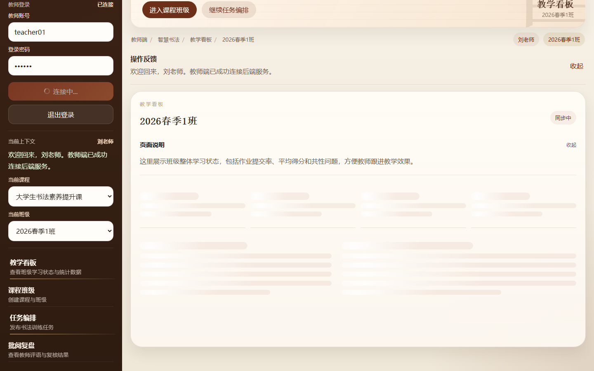
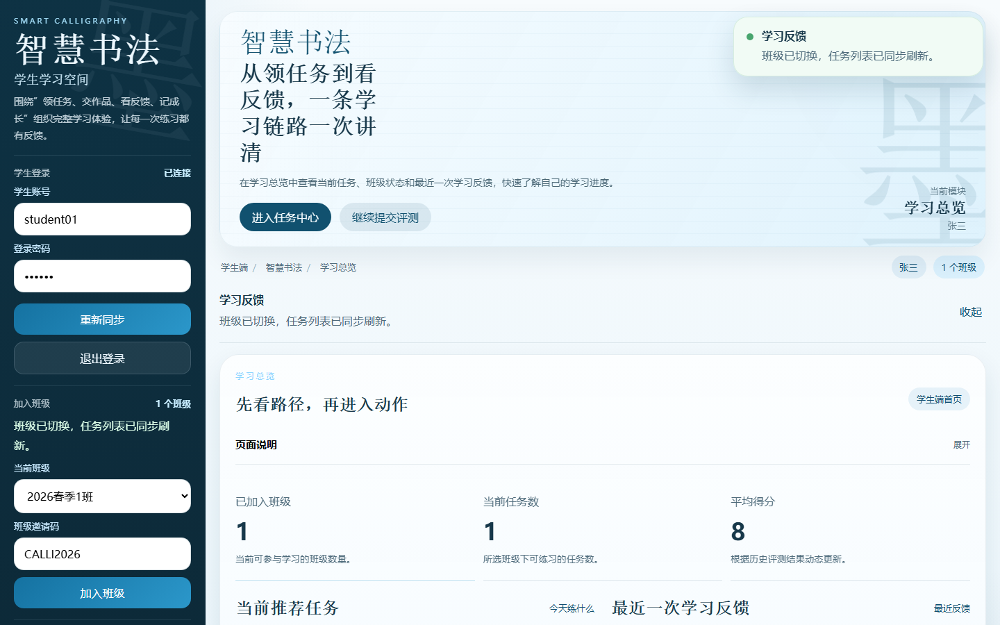
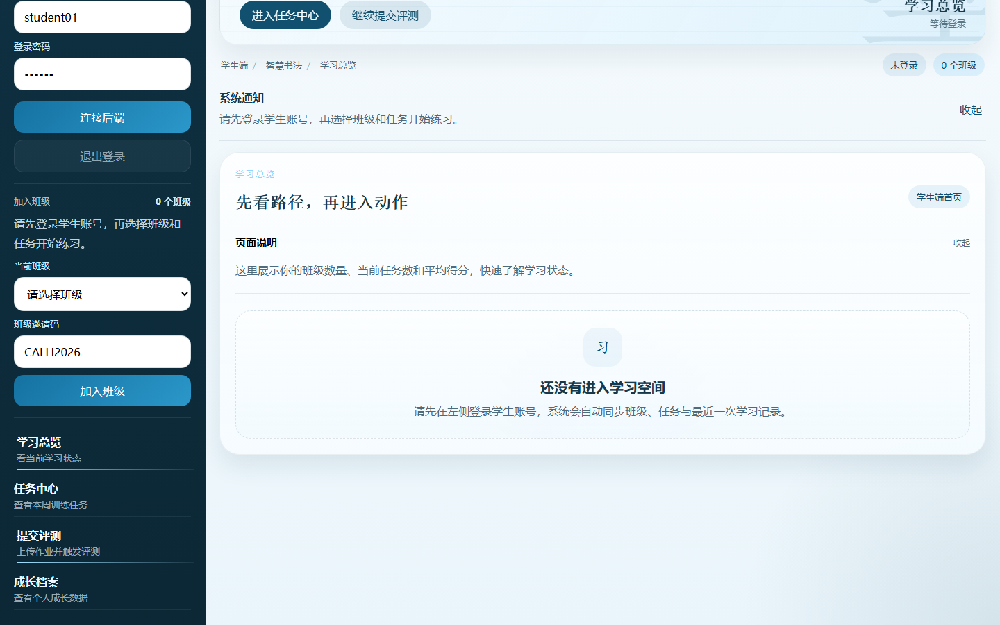
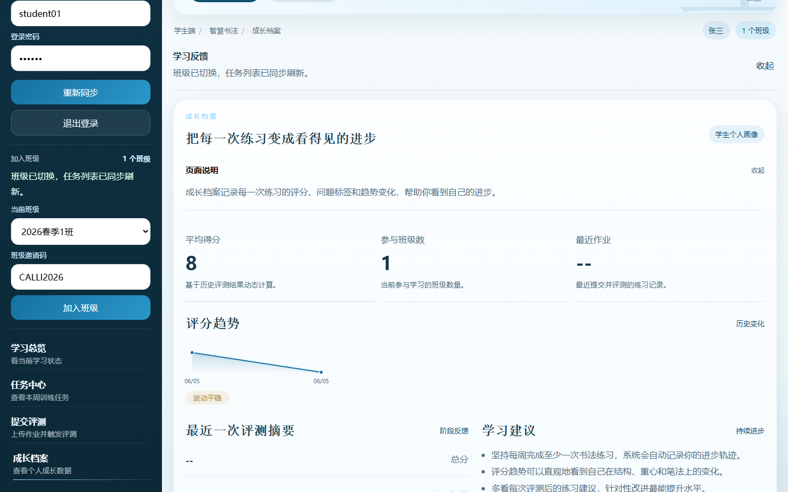

# 智慧书法教学系统 — Smart Calligraphy Education

[](https://github.com/2002yy/smart-calligraphy-edu/actions/workflows/ci.yml)

> **书法教育 AI 评测系统** — 基于 AI 视觉评测的书法教学平台
> 本人为唯一贡献者（全栈开发），涵盖后端架构、AI 评测集成与前后端对接。

> Portfolio Note:
> This is a public course/project demo for AI-powered education software.
> It demonstrates Vue3 dual frontend, FastAPI backend, SQLAlchemy data layer, AI vision scoring and mock fallback.
> It is not a production education platform.
>
> 作品集说明：
> 本仓库是智慧教育方向的公开课程/项目演示版，用于展示 Vue3 双端前端、FastAPI 后端、SQLAlchemy 数据层、AI 视觉评测和 Mock fallback。
> 当前不是生产级教学平台。

---

## 1. 📌 项目一句话定位

**书法教育 AI 评测系统** — 教师端管理教学流程，学生端提交书法作品并获得 AI 即时评分反馈。基于 Vue 3 + FastAPI + 阿里云百炼 qwen3.5-omni-plus 构建。

> ⚠️ **定位说明**：书法教育 AI 评测展示系统，Vue 3 + FastAPI + AI 视觉评测全栈项目。公开课程/项目演示版。

---

## 2. 🖼️ Screenshots / Demo

### 核心展示页面

| 模块 | 截图 | 说明 |
|------|------|------|
| 👨‍🏫 教师端 | [教学看板](docs/demo/screenshots/01-teacher-dashboard.png) | 登录后教学看板，左侧选择课程/班级，右侧展示班级统计数据 |
| 👨‍🏫 教师端 | [任务编排](docs/demo/screenshots/02-task-publish.png) | 发布书法练习任务、设定练习字和评分权重 |
| 👩‍🎓 学生端 | [学习总览](docs/demo/screenshots/03-student-overview.png) | 学生登录后的学习总览，展示班级、任务和最近反馈 |
| 👩‍🎓 学生端 | [作品提交](docs/demo/screenshots/04-student-upload.png) | 提交书法作品页面，支持拍照/上传 |
| 📈 成长档案 | [历史记录](docs/demo/screenshots/05-growth-archive.png) | 历次评分趋势与教师评语 |


*教师端教学看板 — 班级学习状态与统计数据*


*任务编排 — 发布书法训练任务并设定评分权重*


*学生学习总览 — 当前任务与最近反馈*


*作品上传 — 拍照/提交书法作业*


*成长档案 — 历次评分趋势与反馈*

### 🎬 Demo 视频

[](docs/demo/demo-recording.mp4)
*点击截图观看完整操作演示（教师登录 → 任务发布 → 学生上传 → AI 评分 → 成长档案）*

> 视频文件: [`docs/demo/demo-recording.mp4`](docs/demo/demo-recording.mp4)
> 更多截图与录制清单见 [`docs/demo/README.md`](docs/demo/README.md)

---

## 3. ⚡ Tech Stack

| 模块 | 技术 | 说明 |
|------|------|------|
| **教师端** | Vue 3 + Vite + Pinia | 教学管理前端（5173） |
| **学生端** | Vue 3 + Vite + Pinia | 学习空间前端（5174） |
| **业务后端** | FastAPI + SQLAlchemy | API 服务（8000） |
| **AI 评测** | qwen3.5-omni-plus (DashScope) | 书法作品智能评分 |
| **Mock 评测** | 内置 MockEvaluator | 无 API Key 时可用本地演示 |
| **数据库** | SQLite | 本地开发 |
| **测试** | Playwright | 端到端烟雾测试 |

---

## 4. 🎯 Core Features

- 👨‍🏫 **教师端** — 教学流程管理、学生作品批阅、评分查看
- 👩‍🎓 **学生端** — 作品提交、AI 即时评分反馈
- 🤖 **AI 书法评测** — 基于视觉大模型的书法质量评分（结构/重心/笔法三维）
- 🔄 **前后端分离** — Vue 3 + FastAPI 标准架构
- 🎭 **Mock Fallback** — 无 API Key 时使用内置 Mock 评分器演示

---

## 5. 🏗️ Architecture

```
teacher-web (5173) ─┐
                      ├─► api-server (8000) ──► SQLite
student-app (5174) ──┘       │
                              ├──► qwen3.5-omni-plus (DashScope) AI 评测
                              └──► MockEvaluator (本地回退)
```

### AI 评测流程

```
用户上传图片
  → FastAPI 接收文件
  → 读取任务/评分权重
  → 调用 qwen3.5-omni-plus 或 Mock evaluator
  → 返回 结构/重心/笔法 三维分数
  → 生成问题标签和练习建议
  → 前端展示评分和教师复盘入口
```

---

## 6. 🚀 Quick Start

### 前置条件
- Node.js 18+
- Python 3.10+
- 阿里云百炼 DashScope API Key（可选，Mock 模式无需）

### 本地运行

```bash
# ① 启动后端
cd api-server
pip install -r requirements.txt
cp .env.example .env
uvicorn app.main:app --reload --port 8000

# ② 启动教师端
cd teacher-web
npm install
npm run dev

# ③ 启动学生端
cd student-app
npm install
npm run dev
```

### 访问地址

| 端 | 地址 |
|------|------|
| 教师端 | http://localhost:5173 |
| 学生端 | http://localhost:5174 |
| API 文档 | http://localhost:8000/docs |

---

## 7. 🔐 Permission Matrix

| 资源 | Student | Teacher | Public |
|------|---------|---------|--------|
| homework upload | ✅ 自己的 | ❌ | — |
| homework submit | ✅ 自己的 | ❌ | — |
| homework list/detail | ✅ 自己的 | ✅ 自己课程下 | — |
| evaluation start/get | ✅ 自己的 | ✅ 自己课程下 | — |
| review list/submit | ❌ | ✅  从 token | — |
| course create | ❌ | ✅  从 token | — |
| class create/join | ✅ join(自己的) | ✅ create(归属校验) | — |
| class members | ❌ | ✅ 归属校验 | — |
| report student | ✅ 自己的 | ✅ | — |
| report class | ❌ | ✅  | — |
| user/growth | ✅ 自己的 | ✅ 班级关系校验 | — |
| static resources | — | — | ✅ 签名 token path 绑定 |
|  | — | — | ✅ 公开 |

---

## 8. 🗄️ Database Migration

Use Alembic for schema migration. Auto-runs on dev startup; manual for production.

```bash
cd api-server
alembic upgrade head           # apply pending migrations
alembic history                # view migration history
alembic revision --autogenerate -m "description"  # generate from model changes
```

- **dev** environment: `init_db()` runs `alembic upgrade head`, falls back to `create_all` on failure
- **production / staging**: migration failure blocks startup (no silent fallback)

Config in `alembic.ini` + `alembic/env.py` (auto-imports all models).

---

## 9. 🧪 Testing / Quality

| 类型 | 覆盖范围 | 用例数 | 状态 |
|------|---------|--------|------|
| **pytest**（后端） | 登录认证、权限校验、Mock 评测、provider 选择、分数范围、思考链、跨用户/跨角色负例 | **74** | ✅ |
| **Vitest**（前端 store） | 登录/登出、班级、任务、提交、评测、文件选择 | **15** | ✅ |
| **Playwright**（E2E） | API 冒烟 → 上传 → Mock 评测 → 看板回流 → UI 截图 | **全链路** | ✅ 本地可用，✅ CI 已接入 |
| API 文档 | FastAPI `/docs` 自动生成 | — | ✅ |
| Mock Evaluator | 无 API Key 时本地演示 | — | ✅ |

---

## 10. 🛡️ Public Version Boundary

| 项目 | 说明 |
|------|------|
| **API Key** | 不提交真实 API Key（`.env` 已 gitignored） |
| **AI 评测** | 默认 Mock 评分，无需 Key 可演示 |
| **测试图片** | 仅本地演示，不公开暴露 |
| **外网部署** | 必须开启 `SECURE_STATIC=true` 和配置 `CORS_ORIGINS` 白名单 |
| **作品图片** | 签名 token 验证 + path 绑定 |

---

## 11. 📄 Portfolio Notes

### 作品集说明

本仓库是 AI 教育方向的公开项目演示，重点展示：

| 能力维度 | 体现 |
|---------|------|
| **Vue 3 双端前端** | 教师端 + 学生端独立 SPA，共享组件库 |
| **FastAPI 后端** | 异步 API、SQLAlchemy ORM、Pydantic 校验 |
| **AI 视觉评测集成** | 大模型 API 调用 + Mock 回退模式 |
| **全栈对接** | 前后端联调、API 文档、环境配置 |

### License

MIT License
