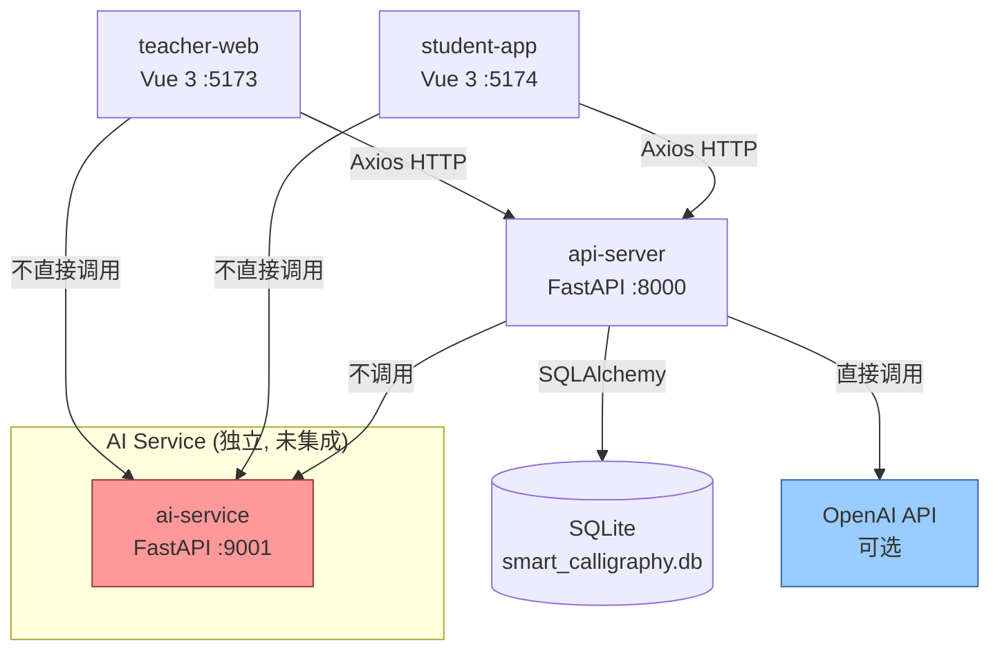
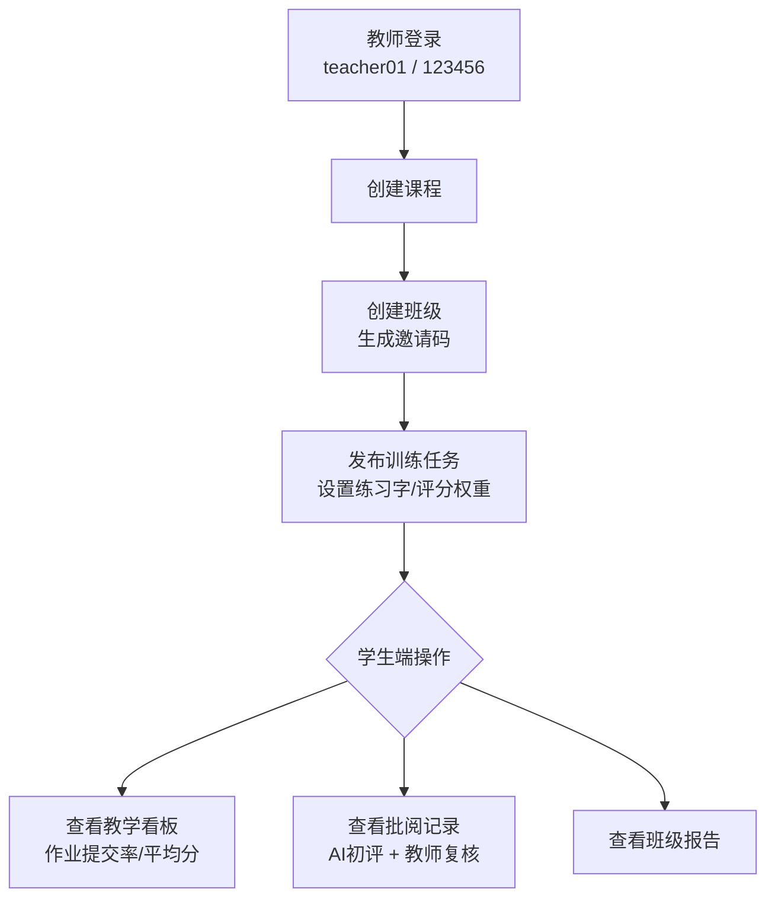
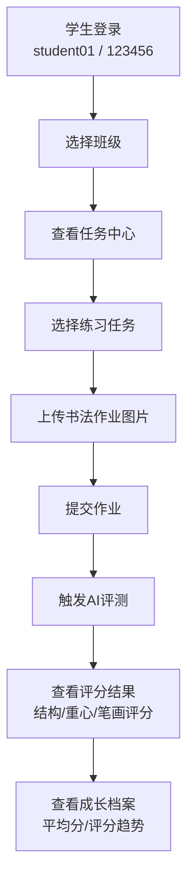

# 智慧书法教学软件 — 项目文档

> 本文档覆盖项目架构、用户使用流程、API 调用链路、数据模型、演示路径及已知问题。

---

## 目录

1. [项目概述](#1-项目概述)
2. [系统架构](#2-系统架构)
3. [数据模型](#3-数据模型)
4. [用户使用流程](#4-用户使用流程)
5. [API 调用流程](#5-api-调用流程)
6. [演示推荐链路](#6-演示推荐链路)
7. [前端路由与页面](#7-前端路由与页面)
8. [环境变量与配置](#8-环境变量与配置)
9. [已知问题与 Bug](#9-已知问题与-bug)

---

## 1. 项目概述

智慧书法教学软件是一个面向大创答辩与校内试点的书法教学演示系统，提供教师端（教学管理）和学生端（练习评测）双入口，支持 AI 智能评测（Mock 模式 / OpenAI 模式）。

### 核心模块

| 模块 | 技术栈 | 端口 | 说明 |
|------|--------|------|------|
| teacher-web | Vue 3 + Vite + Pinia + Axios | 5173 | 教师教学中枢：建课、建班、发任务、看评测、做复盘 |
| student-app | Vue 3 + Vite + Pinia + Axios | 5174 | 学生学习空间：领任务、交作品、看反馈、记成长 |
| api-server | FastAPI + SQLAlchemy + SQLite | 8000 | 业务后端：用户认证、课程班级、任务作业、评测批阅 |
| ai-service | FastAPI（独立服务，**未集成**） | 9001 | AI 能力服务（评分、分割、预处理等，当前为存根） |

### 演示默认账号

| 角色 | 用户名 | 密码 | 说明 |
|------|--------|------|------|
| 教师 | teacher01 | 123456 | 教师端演示账号 |
| 学生 | student01 | 123456 | 学生端演示账号 |

---

## 2. 系统架构



### 目录结构

```
code/
├── teacher-web/              # 教师端前端
│   └── src/
│       ├── api.ts            # API 调用封装
│       ├── lib/request.ts    # Axios 实例 + 拦截器
│       ├── stores/teacher.ts # Pinia 状态管理
│       ├── types.ts          # TypeScript 类型定义
│       └── views/            # 页面组件
├── student-app/              # 学生端前端
│   └── src/
│       ├── api.ts            # API 调用封装
│       ├── lib/request.ts    # Axios 实例 + 拦截器
│       ├── stores/student.ts # Pinia 状态管理
│       ├── types.ts          # TypeScript 类型定义
│       └── views/            # 页面组件
├── api-server/               # 业务后端
│   └── app/
│       ├── api/routes/       # 路由层（9 个路由模块）
│       ├── services/         # 业务逻辑层
│       ├── repositories/     # 数据访问层
│       ├── models/           # SQLAlchemy 模型
│       ├── schemas/          # Pydantic 数据模式
│       └── core/             # 配置、数据库、引导
├── ai-service/               # AI 服务（未集成）
│   └── app/api/routes/       # 路由（score, segment, preprocess 等）
├── docs/                     # 文档
├── scripts/                  # 启动脚本
└── playwright-smoke/         # E2E 冒烟测试
```

---

## 3. 数据模型

### 核心表结构

```
users              # 用户表（教师/学生）
├── id, username, password_hash, name, role, school_name, avatar_url
└── role: "teacher" | "student"

courses            # 课程表
├── id, name, term, teacher_id, description, status
└── status: "active" | "archived"

classes            # 班级表
├── id, course_id, name, invite_code, student_count
└── invite_code: 学生加入班级的邀请码

class_members      # 班级成员表
└── class_id, student_id

tasks              # 任务表
├── id, course_id, class_id, title, description, deadline
├── structure_weight, center_weight, stroke_order_weight
└── created_by (user.id)

task_characters    # 任务练习字表
└── task_id, character, sort_order

homework           # 作业表
├── id, task_id, student_id, image_url, processed_image_url
└── status: "uploaded" | "submitted" | "evaluated"

evaluations        # 评测表
├── id, homework_id, total_score, structure_score, center_score, stroke_order_score
├── issues_json(JSON), advice_text, compare_image_url, thinking_steps(JSON)
└── status: "finished"

reviews            # 教师批阅表
├── id, homework_id, teacher_id, comment, final_score
└── status: "reviewed" | "pending"
```

### 模型关系图

```
Course 1──N Class 1──N Task 1──N TaskCharacter
                        │
Class 1──N ClassMember N──1 User (student)
                        │
Task 1──N Homework N──1 User (student)
            │
Homework 1──1 Evaluation
Homework 1──1 Review N──1 User (teacher)
```

---

## 4. 用户使用流程

### 4.1 教师端使用流程



#### 步骤详解

**Step 1: 登录**
- 左侧登录区输入账号密码，点击"连接后端"
- 系统自动同步课程列表、班级列表
- 自动加载看板数据、任务列表、批阅记录

**Step 2: 创建课程（管理页）**
- 进入"课程班级"页面
- 填写课程名称（如"大学生书法素养提升课"）、开课学期、课程说明
- 点击"创建课程"

**Step 3: 创建班级**
- 选择刚创建的课程
- 填写班级名称（如"2026春季1班"）
- 可选邀请码，留空则由系统生成（演示数据预设 `CALLI2026`）
- 点击"创建班级"

**Step 4: 发布任务（任务编排页）**
- 选择课程和班级
- 填写任务标题、练习字（如"永、木、中、人"）
- 评分维度：结构布局 40% / 重心控制 30% / 笔顺规范 30%（固定值）
- 可选截止时间
- 点击"发布任务"

**Step 5: 查看教学看板**
- 展示班级平均分、作业提交率、累计作业数、已完成评测数
- 展示班级整体状态（学生人数、任务数）
- 展示共性问题标签
- 展示班级报告摘要

**Step 6: 查看批阅记录**
- 展示 AI 初评分数与教师终评分数
- 支持按作业状态（已批阅/待补评）和 AI 结果筛选
- 点击展开详情可查看完整批阅上下文

### 4.2 学生端使用流程



#### 步骤详解

**Step 1: 登录**
- 左侧登录区输入账号密码，点击"连接后端"
- 系统自动同步班级列表、任务列表、成长数据

**Step 2: 加入班级**
- 选择班级，输入邀请码（演示：`CALLI2026`）
- 点击"加入班级"

**Step 3: 查看任务（任务中心页）**
- 一列展示当前班级下的训练任务
- 右侧展示选中任务的详情：练习字、评分权重、截止时间

**Step 4: 提交评测（提交评测页）**
- **方式一：一站式** — 选择图片后点击"提交后直接触发 AI 评分"
  - 自动完成：上传 → 提交 → 评测（OpenAI）
- **方式二：分步操作**
  - 先"仅提交作业"
  - 再"对最近一次作业发起评测"（Mock 模式 / 自动模式）

**Step 5: 查看评测结果**
- 展示 7 步思考链动画（图像预处理 → 文字区域检测 → 单字分割 → 结构分析 → 重心检测 → 笔顺验证 → 综合评分）
- 展示分数环：总分 / 结构 / 重心 / 笔画
- 展示练习建议和问题标签

**Step 6: 查看成长档案**
- 展示平均得分、参与班级数、最近作业
- 评分趋势图（≥2 次评测时显示）
- 最近一次评测摘要（总分、问题标签、建议）

---

## 5. API 调用流程

### 5.1 统一规范

- **基础 URL**: `http://127.0.0.1:8000`
- **响应格式**:
  ```json
  {
    "code": 0,          // 0=成功，非0=失败
    "message": "ok",
    "data": { ... }     // 实际数据
  }
  ```
- **认证方式**: Bearer Token（演示用 `dev-token-{user_id}`）
  - Token 存储在 `localStorage`（teacher_token / student_token）
  - 每次请求通过 Axios 拦截器自动注入 `Authorization` 头
- **文件上传**: multipart/form-data

### 5.2 完整 API 路由清单

#### Auth（认证）

| 方法 | 路径 | 说明 | 请求 | 响应 |
|------|------|------|------|------|
| POST | `/api/v1/auth/login` | 登录 | `{username, password}` | `{access_token, token_type, expires_in, user}` |
| GET | `/api/v1/auth/me` | 当前用户 | Header: `Authorization` | `{id, username, name, role}` |

#### Courses（课程）

| 方法 | 路径 | 说明 | 请求参数 |
|------|------|------|----------|
| GET | `/api/v1/courses` | 课程列表 | `?teacher_id=&status=` |
| POST | `/api/v1/courses` | 创建课程 | `{name, term, description, teacher_id}` |
| GET | `/api/v1/courses/{id}` | 课程详情 | |

#### Classes（班级）

| 方法 | 路径 | 说明 | 请求参数 |
|------|------|------|----------|
| GET | `/api/v1/classes` | 班级列表 | `?course_id=` |
| POST | `/api/v1/classes` | 创建班级 | `{course_id, name, invite_code}` |
| POST | `/api/v1/classes/{id}/join` | 加入班级 | `{invite_code, student_id}` |
| GET | `/api/v1/classes/{id}/members` | 班级成员 | |

#### Tasks（任务）

| 方法 | 路径 | 说明 | 请求参数 |
|------|------|------|----------|
| GET | `/api/v1/tasks` | 任务列表 | `?class_id=&course_id=` |
| POST | `/api/v1/tasks` | 创建任务 | `{course_id, class_id, title, practice_chars, ...}` |
| GET | `/api/v1/tasks/{id}` | 任务详情 | |

#### Homework（作业）

| 方法 | 路径 | 说明 | 请求 |
|------|------|------|------|
| POST | `/api/v1/homework/upload` | 上传图片 | FormData: `task_id, student_id, file` |
| POST | `/api/v1/homework` | 提交作业 | `{homework_id, task_id, student_id, image_url}` |
| GET | `/api/v1/homework` | 作业列表 | `?task_id=&student_id=&status=` |
| GET | `/api/v1/homework/{id}` | 作业详情 | |

#### Evaluation（评测）

| 方法 | 路径 | 说明 | 请求 |
|------|------|------|------|
| POST | `/api/v1/evaluation/start` | 触发评测 | `{homework_id, provider, force_refresh}` |
| GET | `/api/v1/evaluation/{homework_id}` | 评测结果 | |

`provider` 可选值:
- `"auto"` — 自动选择（有 OpenAI 配置则用 OpenAI，否则 Mock）
- `"mock"` — Mock 模式（基于 `homework_id` 生成有规律数据）
- `"openai"` — OpenAI 模式（需配置 `OPENAI_API_KEY`）

#### Reviews（批阅）

| 方法 | 路径 | 说明 | 请求 |
|------|------|------|------|
| GET | `/api/v1/reviews` | 批阅列表 | `?teacher_id=&homework_id=` |
| POST | `/api/v1/reviews` | 提交批阅 | `{homework_id, teacher_id, comment, final_score, status}` |
| GET | `/api/v1/reviews/{homework_id}` | 批阅详情 | |

#### Dashboard（看板）

| 方法 | 路径 | 说明 |
|------|------|------|
| GET | `/api/v1/dashboard/class/{class_id}` | 班级教学看板 |

#### Reports（报告）

| 方法 | 路径 | 说明 |
|------|------|------|
| GET | `/api/v1/reports/student/{student_id}` | 学生成长报告 |
| GET | `/api/v1/reports/class/{class_id}` | 班级统计报告 |
| POST | `/api/v1/reports/export` | 导出报告 |

#### Users（用户）

| 方法 | 路径 | 说明 |
|------|------|------|
| GET | `/api/v1/users/{user_id}` | 用户信息 |
| GET | `/api/v1/users/{user_id}/growth` | 学生成长数据 |

### 5.3 关键 API 调用序列

#### 教师端登录引导序列

```
teacher-web                          api-server
    │                                    │
    │── POST /api/v1/auth/login ────────>│ 登录
    │<──── {access_token, user} ─────────│
    │                                    │
    │── GET /api/v1/auth/me ────────────>│ 验证会话
    │<──── {id, username, name, role} ───│
    │                                    │
    │── GET /api/v1/courses?teacher_id= ─>│ 获取课程列表
    │<──── [{id, name, term, ...}] ──────│
    │                                    │
    │── GET /api/v1/classes?course_id= ──>│ 获取班级列表
    │<──── [{id, name, invite_code, ...}] │
    │                                    │
    │  (并行请求班级关联数据)              │
    │── GET /api/v1/tasks?class_id= ────>│ 任务列表
    │── GET /api/v1/reviews?teacher_id= ─>│ 批阅列表
    │── GET /api/v1/dashboard/class/{id} >│ 看板数据
    │── GET /api/v1/reports/class/{id} ──>│ 班级报告
    │                                    │
```

#### 学生评测完整序列

```
student-app            api-server
    │                      │
    │── POST /login ──────>│ 登录
    │<── token + user ─────│
    │                      │
    │── GET /classes ─────>│ 获取班级
    │<── [{id, name, ...}] ─│
    │                      │
    │── POST /classes/{id}/join ──>│ 加入班级
    │<── {status: "joined"} ──────│
    │                      │
    │── GET /tasks?class_id= ───>│ 获取任务
    │<── [{id, title, ...}] ─────│
    │                      │
    │  ╔═══ 上传 + 提交 + 评测 ═══╗
    │── POST /homework/upload ──>│ FormData(file)
    │<── {homework_id, file_url} │
    │                      │
    │── POST /homework ──────────>│ 提交作业
    │    {homework_id, task_id,  │
    │     student_id, image_url} │
    │<── {id, status:"submitted"}│
    │                      │
    │── POST /evaluation/start ──>│ 触发评测
    │    {homework_id, provider} │
    │    ──> _build_mock_result()│ (或 OpenAI API)
    │<── {status, evaluation_id} │
    │                      │
    │── GET /evaluation/{id} ───>│ 获取结果
    │<── {score, tags, advice}  │
    │                      │
    │── GET /users/{id}/growth ─>│ 成长数据
    │<── {avg_score, ...}        │
```

### 5.4 评测模式对比

| 特性 | Mock 模式 | Qwen3.5-Plus 模式 ⭐ | OpenAI 模式（DEPRECATED） |
|------|-----------|----------------------|--------------------------|
| 触发条件 | `provider="mock"` 或自动降级 | `provider="qwen"` / `"auto"` 且 Qwen 已配置 | `provider="openai"` 且配置有效 |
| 支付方式 | 无需 | 支付宝，无需 Visa | 需国际信用卡 |
| 国内直连 | ✅ | ✅ | ❌ 需代理 |
| 评分逻辑 | 基于 `homework_id % 8 + 82` 随机 | Qwen3.5-Plus 视觉模型分析图片 | GPT-4.1 视觉模型分析图片 |
| 思考链 | 7 步固定步骤，中文描述 | 由模型生成，中文描述，含分步分数 | 由模型生成，含分步分数 |
| 子维度分数 | 结构/重心/笔顺各有偏差策略 | 统一使用总分 | 统一使用总分 |
| 问题标签 | 基于总分分档（2 组） | 由模型生成（2-4 个，中文） | 由模型生成（2-4 个） |
| 图片依赖 | 不依赖 | 依赖上传图片 | 依赖上传图片 |
| 速度 | 即时 | 数秒 | 数秒 |
| 配置 | 默认可用 | 需设置 `QWEN_API_KEY` | 需设置 `OPENAI_API_KEY` |
| 单次成本 | 免费 | ~¥0.001 | ~$0.01 |

---

## 6. 演示推荐链路

### 完整演示路径（从教师到学生再回到教师）

```
Step 1: 启动 api-server -> localhost:8000
Step 2: 启动 teacher-web -> localhost:5173
Step 3: 启动 student-app -> localhost:5174

教师端:
  ├─ 登录 teacher01 / 123456
  ├─ 查看"教学看板"（初始空状态）
  ├─ 进入"课程班级" → 创建课程 → 创建班级
  └─ 进入"任务编排" → 发布训练任务

学生端:
  ├─ 登录 student01 / 123456
  ├─ 选择班级 → 输入邀请码加入
  ├─ 进入"任务中心"查看任务
  ├─ 进入"提交评测" → 上传书法图片
  ├─ 点击"提交后直接触发 AI 评分"
  └─ 查看评分结果 → 进入"成长档案"

回到教师端:
  ├─ 查看"教学看板" → 数据已回流
  └─ 查看"批阅复盘" → AI 初评已生成
```

---

## 7. 前端路由与页面

### 教师端路由

| 路径 | 页面组件 | 说明 |
|------|----------|------|
| `/dashboard` | `TeacherDashboardPage.vue` | 教学看板主页 |
| `/manage` | `TeacherManagePage.vue` | 课程班级管理 |
| `/tasks` | `TeacherTaskPage.vue` | 任务编排管理 |
| `/reviews` | `TeacherReviewPage.vue` | 批阅复盘 |

### 学生端路由

| 路径 | 页面组件 | 说明 |
|------|----------|------|
| `/overview` | `StudentOverviewPage.vue` | 学习总览 |
| `/tasks` | `StudentTaskPage.vue` | 任务中心 |
| `/submit` | `StudentSubmitPage.vue` | 提交评测（含思考链动画） |
| `/growth` | `StudentGrowthPage.vue` | 成长档案（评分趋势图） |

---

## 8. 环境变量与配置

### api-server 配置 (.env)

| 变量 | 默认值 | 说明 |
|------|--------|------|
| `DATABASE_URL` | `sqlite:///./smart_calligraphy.db` | 数据库连接 |
| `STORAGE_ROOT` | `./storage` | 上传文件存储路径 |
| `EVALUATION_PROVIDER` | `mock` | 默认评测提供商 |
| `OPENAI_EVALUATION_ENABLED` | `false` | 是否启用 OpenAI 评测 |
| `OPENAI_API_KEY` | - | OpenAI API 密钥 |
| `OPENAI_BASE_URL` | - | OpenAI 自定义端点 |
| `OPENAI_EVALUATION_MODEL` | `gpt-4.1` | 评测模型 |
| `OPENAI_IMAGE_DETAIL` | `low` | 图片分析精度 |
| `OPENAI_IMAGE_MAX_SIZE` | `768` | 图片压缩尺寸 |
| `SECURE_STATIC` | `false` | 是否保护 /uploads 路径 |

### 前端配置 (.env)

| 变量 | 默认值 | 说明 |
|------|--------|------|
| `VITE_API_BASE_URL` | `http://127.0.0.1:8000` | API 后端地址 |

### 启动方式

```bash
# 后端
cd api-server
pip install -r requirements.txt
uvicorn app.main:app --reload --port 8000

# 教师端
cd teacher-web
npm install
npm run dev

# 学生端
cd student-app
npm install
npm run dev
```

---

## 9. 已知问题与 Bug

### Bug 1: Vue 模板中使用了 Unicode 智能引号（❌ 语法错误）

**影响文件**（6 个 `.vue` 文件）：

| 文件 | 行号 | 错误内容 |
|------|------|----------|
| `student-app/src/views/StudentTaskPage.vue` | 23 | `storageKey="intro-task"` |
| `student-app/src/views/StudentSubmitPage.vue` | 151 | `storageKey="intro-submit"` |
| `student-app/src/views/StudentOverviewPage.vue` | 24 | `storageKey="intro-overview"` |
| `student-app/src/views/StudentGrowthPage.vue` | 29 | `storageKey="intro-growth"` |
| `teacher-web/src/views/dashboard/index.vue` | 26 | `storageKey="intro-dashboard"` |
| `teacher-web/src/views/task/index.vue` | 63 | `storageKey="intro-task"` |

**问题描述**：`CollapsibleIntro` 组件的 `storageKey` 属性值使用了 Unicode 智能引号 `"` (U+201C) 和 `"` (U+201D) 代替标准 ASCII 引号 `"` (U+0022)。Vue 的 HTML 模板解析器无法识别智能引号作为属性定界符，导致：
- Vue 编译时触发解析错误
- `storageKey` 属性无法正确绑定
- 页面渲染时 `CollapsibleIntro` 组件表现异常

**修复方案**：将所有 `"..."` 替换为 `"..."`。

**注意**：Vue 模板内的中文文本内容（如 `"今天练什么"`）中的智能引号不会导致模板解析错误，因为它们位于文本内容中而非属性值中。**但建议统一替换为常规引号**以保证编码一致性。

---

### Bug 2: ai-service 独立服务未与 api-server 集成（🔶 设计问题）

**问题描述**：`ai-service/` 目录包含一个独立的 FastAPI 服务，提供了评分 (`/ai/v1/score`)、分割 (`/ai/v1/segment`)、预处理 (`/ai/v1/preprocess`)、推荐 (`/ai/v1/recommend`)、问答 (`/ai/v1/qa`) 等端点。但 `api-server` 的 `EvaluationService` 从未调用此服务进行评测：

- Mock 模式下，直接在 `api-server` 内存中生成模拟分数（`evaluation_service.py:135-176`）
- OpenAI 模式下，直接通过 `openai` SDK 调用 GPT-4.1 API（`openai_evaluation_service.py`）
- `ai-service` 的 `/ai/v1/score` 端点返回硬编码的 mock 数据（`score.py`）

**影响**：冗余服务代码约 5 个路由文件，增加维护负担但无实际作用。

**建议**：
- 如果不需要 AI 服务分离架构，可以删除 `ai-service/` 目录
- 如果需要保留分离架构，在 `EvaluationService` 中集成对 `ai-service` 的 HTTP 调用

---

### ✅ Bug 3: `password_hash` 字段存储明文密码 — **已修复**

**修复内容**：使用 `hashlib.sha256()` 对密码进行哈希后存入数据库，登录比较时同样比较哈希值。
- ...
- ...
- ...

**验证**：28 个后端测试全部通过。

---

### Integration: Qwen3.5-Plus 视觉书法评测（新增）

**新增文件**：
- `api-server/app/services/qwen_evaluation_service.py` — Qwen 视觉评测服务（httpx 调用 DashScope API）
- `api-server/app/schemas/evaluation.py` — `EvaluationProvider` 新增 `qwen` 枚举
- `api-server/app/core/config.py` — 新增 6 个 Qwen 配置项

**修改文件**：
- `api-server/app/services/evaluation_service.py` — 新增 `_build_qwen_result()`，`start()` 中新增 qwen 分支，`_resolve_provider()` 中 auto 模式优先 Qwen
- `api-server/app/services/openai_evaluation_service.py` — 标注 `# DEPRECATED`
- `api-server/.env.example` — Qwen 配置取代 OpenAI 作为推荐
- `student-app/src/api.ts` — provider 类型增加 `"qwen"`
- `student-app/src/stores/student.ts` — 新增 `submitAndEvaluateWithQwen()`，`evaluateHomework()` 支持 qwen
- `student-app/src/views/StudentSubmitPage.vue` — 主按钮改为 Qwen 评测

**使用方法**：在 `api-server/.env` 中设置：
```env
QWEN_EVALUATION_ENABLED=true
QWEN_API_KEY=sk-xxxxxxxxxxxx
```
可在阿里云百炼控制台免费申请 API Key。评测调用时传 `provider: "qwen"` 或 `provider: "auto"`（自动选择）。

---

### Bug 4: 教师端创建任务时 `practiceChars` 前端拆分逻辑

**描述**：在 `teacher-store.ts:314-316` 中，`practiceChars` 按中文顿号、逗号、空格等分割。但如果用户输入不带分隔符的连续汉字（如"永木中人"），每个字符会被正确拆分。但如果用户使用全角逗号或其他非标准分隔符，拆分可能不完整。目前表现正常，但可考虑增加更清晰的前端提示。

---

### Bug 5: 上传文件的 `processed_image_url` 始终为 null

**描述**：`Homework` 模型有 `processed_image_url` 字段，但代码中没有任何地方对该字段进行赋值。在 `evaluation_service.py` 的 `_build_openai_result` 和 `_build_mock_result` 中，`compare_image_url` 也被写死为 `None`。

**影响**：教师端批阅页面的"结果回看图"无法展示 AI 处理后的图像，只能展示原图。

---

### Bug 6: `debug.log` 包含无关错误

**文件**: `code/debug.log`

**内容**: `[0411/234723.752:ERROR:third_party\crashpad\...] CreateFile: 拒绝访问。 (0x5)`

这是 Chrome/Electron crashpad 组件的文件访问错误，与项目代码无关，可以安全删除。

---

### 其他注意事项

1. **认证安全**：Token 格式 `dev-token-{user_id}` 为纯演示用途，无加密和过期验证
2. **CORS**：后端配置 `allow_origins=["*"]`，允许所有来源访问，适用于演示但不应用于生产
3. **SQLite 并发**：使用 SQLite 作为数据库，不支持高并发写入
4. **时间处理**：数据库使用 naive datetime（无时区信息），`utc_now()` 先生成 UTC 时间再剥离时区
5. **学生端思考链动画**：在 `evaluating` 状态切换时使用前端模拟的 7 步动画（非真实流式返回），真正的 thinking_steps 数据在评测完成后一次性写入
6. **前端构建**：Vite 配置文件中的 `server.port` 预设为教师端 5173、学生端 5174，首次启动可用
