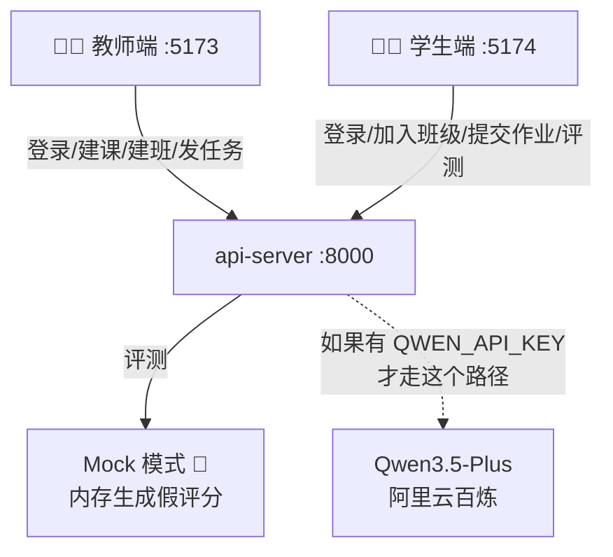

# 全业务流程梳理（含 Fallback 版）

> 当前无 QWEN_API_KEY，系统自动降级为 Mock 模式。
> 本文档梳理每条完整链路，标注 API 调用、数据流向和 Fallback 行为。

---

## 一、总体流程全景



---

## 二、教师端完整流程

### 2.1 登录 → 数据初始化

```
教师输入 teacher01 / 123456
    │
    ├─► POST /api/v1/auth/login             登录认证
    │    Body: {username, password}
    │    ← 200: {access_token, user}
    │
    ├─► GET /api/v1/auth/me                  验证会话（恢复session时单独调用）
    │    Header: Authorization: Bearer dev-token-1
    │    ← 200: {id, username, name, role}
    │
    ├─► GET /api/v1/courses?teacher_id=1     获取课程列表
    │    ← 200: [{id, name, term, ...}]
    │
    ├─► GET /api/v1/classes?course_id=1      获取班级列表（选中第一个课程）
    │    ← 200: [{id, name, invite_code, ...}]
    │
    └─► 并行请求 4 个接口（选中第一个班级后）：
         ├─ GET /api/v1/tasks?class_id=1      任务列表
         ├─ GET /api/v1/reviews?teacher_id=1  批阅列表
         ├─ GET /api/v1/dashboard/class/1     教学看板
         └─ GET /api/v1/reports/class/1       班级报告
```

**数据流向**：
```
POST /login ──→ AuthService.login()
                    ├─ UserRepository.get_by_username("teacher01")
                    ├─ user.password_hash == sha256("123456")
                    └─ return {access_token: "dev-token-1", user: {...}}

GET /courses ──→ CourseService.list_courses()
                    └─ CourseRepository.list_by_teacher(teacher_id=1)
                        └─ SELECT * FROM courses WHERE teacher_id=1

GET /classes ──→ ClassService.list_classes()
                    └─ ClassroomRepository.list_by_course(course_id=1)
                        └─ SELECT * FROM classes WHERE course_id=1
```

---

### 2.2 创建课程

```
教师填写：名称、"2026春"、说明
    │
    └─► POST /api/v1/courses
         Body: {name, term, description, teacher_id}
         ← 200: {id, name, term, ...}

    └─► 成功后自动刷新：
         ├─ GET /api/v1/courses?teacher_id=1  重新拉取课程列表
         └─ 前端 selectedCourseId = 新创建的 course.id
```

**后端链路**：
```
POST /courses ──→ CourseService.create_course()
                    ├─ 校验 teacher 存在
                    └─ CourseRepository.create()
                        └─ INSERT INTO courses
```

---

### 2.3 创建班级

```
教师选课程、填名称、可选邀请码
    │
    └─► POST /api/v1/classes
         Body: {course_id, name, invite_code}
         ← 200: {id, course_id, name, student_count: 0}

    └─► 成功后自动刷新：
         ├─ GET /api/v1/classes?course_id=    重新拉取班级列表
         └─ refreshClassLinkedData → 4 个并行请求
```

---

### 2.4 发布任务

```
教师选课程→班级→填标题→填练习字→选截止时间
    │
    └─► POST /api/v1/tasks
         Body: {
           course_id, class_id, title,
           practice_chars: ["永","大","木","中"],
           structure_weight: 40,
           center_weight: 30,
           stroke_order_weight: 30,
           deadline, created_by
         }
         ← 200: {id, course_id, class_id, title, practice_chars, ...}

    └─► 成功后自动刷新 refreshClassLinkedData
```

**后端链路**：
```
POST /tasks ──→ TaskService.create_task()
                  ├─ 校验课程/班级存在
                  └─ TaskRepository.create_task()
                       ├─ INSERT INTO tasks
                       └─ INSERT INTO task_characters × N
                           └─ ("永","大","木","中") 各一条
```

---

### 2.5 切换课程/班级

```
改变左侧下拉框
    │
    ├─► changeCourse(id):
    │     ├─ GET /api/v1/classes?course_id=    新课程的班级列表
    │     └─ refreshClassLinkedData → 4 个并行请求
    │
    └─► changeClass(id):
          └─ refreshClassLinkedData → 4 个并行请求
```

---

## 三、学生端完整流程

### 3.1 登录 → 数据初始化

```
学生输入 student01 / 123456
    │
    ├─► POST /api/v1/auth/login              登录
    │    ← 200: {access_token, user}
    │
    ├─► GET /api/v1/classes                  获取可加入的班级列表
    │    ← 200: [{id, name, invite_code, ...}]
    │
    ├─► GET /api/v1/tasks?class_id=1         获取选中班级的任务列表
    │    ← 200: [{id, title, practice_chars, ...}]
    │
    └─► GET /api/v1/users/2/growth           获取成长数据
         ← 200: {avg_score, recent_scores, recent_labels}
```

---

### 3.2 加入班级

```
学生选班级→输入邀请码 CALLI2026
    │
    └─► POST /api/v1/classes/{class_id}/join
         Body: {invite_code, student_id}
         ← 200: {class_id, student_id, status: "joined"}

    └─► 刷新：GET /api/v1/classes
```

**后端链路**：
```
POST /classes/{id}/join ──→ ClassService.join_class()
                              ├─ 校验邀请码
                              └─ ClassMemberRepository.add()
                                   ├─ INSERT INTO class_members
                                   └─ UPDATE classes SET student_count += 1
```

---

### 3.3 提交作业 ← 关键闭环

```
学生选图片文件 → 出现本地预览
    │
    ├─► 方案 A：点"提交后触发 Qwen AI 评分" → 需要 API Key，无 Key 时会报错
    │     ├─ POST /api/v1/homework/upload    上传图片（FormData）
    │     ├─ POST /api/v1/homework           提交作业记录
    │     └─ POST /api/v1/evaluation/start   触发评测（provider:"qwen"→400❌）
    │
    ├─► 方案 B：点"提交 + 旧版 GPT 评测" → 同样需要 API Key❌
    │     └─ POST /api/v1/evaluation/start (provider:"openai"→400❌)
    │
    └─► ✅ Fallback 路径（当前可用）：
          Step 1: 点"仅提交作业"
          │   ├─ POST /api/v1/homework/upload ← FormData(file)
          │   │   ← 200: {homework_id, file_url, status:"uploaded"}
          │   │
          │   └─ POST /api/v1/homework
          │       Body: {homework_id, task_id, student_id, image_url}
          │       ← 200: {id, status:"submitted", image_url}
          │
          Step 2: 点"对最近一次作业发起评测"
          │   └─► POST /api/v1/evaluation/start
          │        Body: {homework_id, provider:"auto", force_refresh:true}
          │        │
          │        │  _resolve_provider("auto"):
          │        │    ├─ QwenService.is_configured() → ❌
          │        │    ├─ OpenAI.is_configured() → ❌
          │        │    └─ return EvaluationProvider.mock ✅
          │        │
          │        │  _build_mock_result(作业ID, task):
          │        │    └─ base_score = (82 + homework_id % 8) / 10
          │        │    └─ 结构分 = base + task.structure_weight*0.008
          │        │    └─ 重心分  = base + task.center_weight*0.006 - 0.15
          │        │    └─ 笔顺分  = base + task.stroke_order_weight*0.007
          │        │    └─ 总分    = (结构+重心+笔顺) / 3
          │        │    └─ 总分<8.8 → "center drift, weak finish"
          │        │    └─ 总分≥8.8 → "stable structure, clear main stroke"
          │        │
          │        │  EvaluationRepository.create_evaluation(...)
          │        │    └─ INSERT INTO evaluations
          │        │
          │        │  homework.status = "evaluated"
          │        │    └─ UPDATE homework SET status="evaluated"
          │        │
          │        ← 200: {status, homework_id, evaluation_id, provider:"mock"}
          │
          └─ 结果自动刷新：
               ├─ GET /api/v1/evaluation/{homework_id}  拉取评测结果
               └─ GET /api/v1/users/2/growth             更新成长数据
```

---

### 3.4 查看评测结果

```
POST /evaluation/start 成功后，前端自动调用：
    │
    └─► GET /api/v1/evaluation/{homework_id}
         ← 200: {
           score,          // Mock: ~8.3
           total_score,    // 同上
           structure_score,// Mock: 基于权重+随机
           center_score,
           stroke_order_score,
           tags: ["center drift", "weak finish"],  // 中文或英文
           advice: "Stabilize the center first...",
           thinking_steps: [                        // 7 步
             {step:1, title:"图像预处理", detail:"...", status:"done", score},
             ...
             {step:7, title:"综合评分", detail:"...", status:"done", score}
           ],
           compare_image_url: "/uploads/homework/2/1/xxx.jpg"
         }
```

**前端展示**：
- ScoreRing 4 个：总分 / 结构分 / 重心分 / 笔顺分（max=10）
- 思考链 7 步动画（逐步展开）
- 练习建议标签
- 问题标签列表

---

### 3.5 查看成长档案

```
自动（在 bootstrap 时）或主动刷新：
    │
    └─► GET /api/v1/users/{user_id}/growth
         ← 200: {
           avg_score: 8.3,
           recent_scores: [8.3, 8.5],  // 每次评测追加
           recent_labels: ["第1次", "第2次"]
         }
```

---

## 四、Fallback 路径总结

### 4.1 当前可用的完整演示链路

```
教师端：
  Step 1   teacher01 / 123456  登录
  Step 2   进入"课程班级" → 创建课程
  Step 3   创建班级 → 自动生成邀请码
  Step 4   进入"任务编排" → 填写练习字 → 发布任务
  Step 5   切换回"教学看板"（数据会回流：任务数+1）

学生端：
  Step 6   student01 / 123456  登录
  Step 7   选择班级 → 输入邀请码 → 加入班级
  Step 8   进入"任务中心" → 看到教师发的任务
  Step 9   进入"提交评测"
  Step 9a  选图 → 点"仅提交作业" ✅
  Step 9b  点"对最近一次作业发起评测" ✅（走 Mock）
  Step 10  看评分结果：4 个分数环 + 7 步思考链

回到教师端：
  Step 11  刷新"教学看板" → 提交率/作业数/已评测数已更新
  Step 12  进入"批阅复盘" → 看到 AI 初评分数
```

### 4.2 UI 按钮状态说明

| 按钮 | 点击路径 | 无 API Key 时 |
|------|----------|--------------|
| 🔵 **提交后触发 Qwen AI 评分** | `submitAndEvaluateWithQwen()` → `provider:"qwen"` | **❌ 报错：Qwen 未配置** |
| 🟢 **提交 + 旧版 GPT 评测** | `submitAndEvaluateWithOpenAI()` → `provider:"openai"` | **❌ 报错：OpenAI 未配置** |
| 🟢 **仅提交作业** | `submitHomework()` | ✅ **正常：仅上传+提交** |
| ⚪ **对最近一次作业发起评测** | `evaluateHomework()` → `provider:"auto"` | ✅ **正常：自动降级 Mock** |

**结论**：当前无 Key 的情况下，**只能走 仅提交作业 → 发起评测(Mock) 的两步路径**。一键评测按钮会报配置错误。

---

## 五、完整 API 清单（按调用顺序）

### 教师端登录序列（6 个请求）

```
顺序  Method  Path                             说明
────  ──────  ──────────────────────────────── ─────────────────
  1    POST   /api/v1/auth/login               登录
  2    GET    /api/v1/auth/me                  获取当前用户（session恢复时）
  3    GET    /api/v1/courses?teacher_id=1     课程列表
  4    GET    /api/v1/classes?course_id=1      班级列表
  ── 以下 4 个并行 ──
  5    GET    /api/v1/tasks?class_id=1         任务列表
  6    GET    /api/v1/reviews?teacher_id=1     批阅列表
  7    GET    /api/v1/dashboard/class/1        教学看板
  8    GET    /api/v1/reports/class/1          班级报告
```

### 教师端操作序列

```
顺序  Method  Path                             说明
────  ──────  ──────────────────────────────── ─────────────────
  9    POST   /api/v1/courses                  创建课程
 10    GET    /api/v1/courses?teacher_id=1     刷新课程列表
 11    POST   /api/v1/classes                  创建班级
 12    GET    /api/v1/classes?course_id=       刷新班级列表
 13    POST   /api/v1/tasks                    发布任务
```

### 学生端登录序列（4 个请求）

```
顺序  Method  Path                             说明
────  ──────  ──────────────────────────────── ─────────────────
  1    POST   /api/v1/auth/login               登录
  2    GET    /api/v1/classes                  班级列表
  3    GET    /api/v1/tasks?class_id=1         任务列表
  4    GET    /api/v1/users/2/growth           成长数据
```

### 学生端操作序列（5 个请求）

```
顺序  Method  Path                             说明
────  ──────  ──────────────────────────────── ─────────────────
  5    POST   /api/v1/classes/{id}/join        加入班级
 ── 提交作业 ↘
  6    POST   /api/v1/homework/upload          FormData 上传图片
  7    POST   /api/v1/homework                 提交作业记录
 ── 评测（Mock）↘
  8    POST   /api/v1/evaluation/start         provider:"auto" → Mock
  9    GET    /api/v1/evaluation/{id}          获取评测结果
 10    GET    /api/v1/users/2/growth           更新成长数据
```
