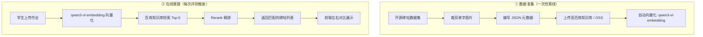

# RAG 碑帖匹配方案 — 完整实施指南

## 一、需求概述

学生上传书法练习作品后，系统不仅给出 AI 评分，还要在结果页附上**对应的名家碑帖字**作为对比参照。

```
学生作业图片
    │
    ├──► AI 评分（结构/重心/笔顺 + 建议）  ← 现有功能
    │
    └──► RAG 检索 → 召回最相似的名家碑帖字
         └──► 左右对比展示（学生作品 vs 名家范本）
```

---

## 二、全链路架构



### 调用时序

```
学生上传图片
    │
    ├─► POST /api/v1/homework/upload         ← 已有
    ├─► POST /api/v1/homework/submit         ← 已有
    │
    ├─► POST /api/v1/evaluation/start         ← 已有（AI 评分）
    │
    ├─► POST /api/v1/evaluation/match          ← 新增
    │     ├─► 图片 → qwen3-vl-embedding 向量化
    │     ├─► 百炼知识库向量检索 Top-5
    │     ├─► Rerank 精排
    │     └─► 返回 [{calligrapher, style, image_url, similarity}]
    │
    └─► 前端展示
          ├─ 左侧：学生作业图片
          ├─ 右侧：最相似的名家碑帖字 + 书法家 + 字体风格
          └─ 底部：AI 对比分析（"你的字与欧阳询九成宫的差异..."）
```

---

## 三、数据集来源

### 3.1 开源数据集

| 数据集 | 规模 | 覆盖 | 下载 |
|--------|------|------|------|
| **chinese-calligraphy-dataset** ⭐ | **138,499 张**，19 位书法家，7,328 个汉字 | 含欧阳询、颜真卿、柳公权、赵孟頫、王羲之等多位名家 | [GitHub](https://github.com/luoyuqi-lab/chinese-calligraphy-dataset) |
| **ARMCD（古代碑帖与写本）** | 15,553 张，42 部碑帖，200+ 书法家 | 颜真卿《东方朔画像赞》、赵孟頫《胆巴碑》、柳公权《玄秘塔》、宋徽宗瘦金体等 | [GitHub](https://github.com/lhl322001/ARMCD) |
| **kai_character_dataset** | 856 张 | 颜真卿风格楷书 | [GitHub](https://github.com/QiangZiBro/kai_character_dataset) |
| **Kaggle Calligraphy Styles** | 2,000 张，含楷书 ~500 张 | 篆/草/隶/楷四种书体 | [Kaggle](https://www.kaggle.com/datasets/richardcsuwandi/chinese-calligraphy-styles/data) |
| **书格（高清碑帖扫描）** | 2,000+ 套古籍碑帖 PDF | 九成宫、多宝塔、玄秘塔等原帖扫描 | [shuge.org](https://new.shuge.org/) |

### 3.2 建议选用

**首选 chinese-calligraphy-dataset**（138,499 张，19 位书法家，含楷书所有主要名家），其次用 **ARMCD** 补充古代碑帖单字。

下载后按以下目录结构存放：

```
storage/calligraphy_db/
├── ouyangxun/
│   ├── 永.jpg
│   ├── 大.jpg
│   └── ...
├── yan_zhenqing/
├── liugongquan/
├── zhao_mengfu/
├── wangxizhi/
└── ...
```

### 3.3 数据量估算

| 书法家 | 风格 | 收集字数 | 图片数 |
|--------|------|---------|--------|
| 欧阳询 | 欧楷 | ~800 | ~800 |
| 颜真卿 | 颜楷 | ~800 | ~800 |
| 柳公权 | 柳楷 | ~500 | ~500 |
| 赵孟頫 | 赵楷 | ~500 | ~500 |
| 王羲之 | 行/楷 | ~500 | ~500 |
| **合计** | | | **~3100 张** |

每张压缩后 50-200KB，总存储约 200-600MB。

---

## 四、知识库元数据结构

### 4.1 元数据 JSON 格式（每条碑帖一张）

```json
{
  "image_url": "https://your-domain.com/storage/calligraphy_db/ouyangxun/永.jpg",
  "character": "永",
  "calligrapher": "欧阳询",
  "style": "欧楷",
  "source": "九成宫醴泉铭",
  "period": "唐代",
  "features": {
    "structure": "中宫收紧、横细竖粗、撇捺开张",
    "center": "重心居中略偏左，起笔位置准确",
    "stroke": "笔顺规范、运笔挺劲"
  },
  "description": "欧阳询楷书「永」字，出自《九成宫醴泉铭》，为欧楷经典范本。结构险绝中求平正，是初学者临摹的典范。"
}
```

### 4.2 CSV 格式（批量导入用）

```csv
image_url,character,calligrapher,style,source,period,description
https://.../ouyangxun/永.jpg,永,欧阳询,欧楷,九成宫醴泉铭,唐代,"欧阳询楷书「永」字，结构险绝中求平正..."
https://.../yan_zhenqing/永.jpg,永,颜真卿,颜楷,多宝塔碑,唐代,"颜真卿楷书「永」字，雄强茂密..."
```

### 4.3 百炼知识库字段映射

在百炼知识库中创建数据表时，字段类型按以下映射：

| 业务字段 | 百炼字段类型 | 作用 |
|---------|-------------|------|
| `image_url` | **image_url** | 图片链接，百炼自动提取向量用于以图搜图 |
| `character` | text | 汉字本身，可做文本过滤 |
| `calligrapher` | text | 书法家姓名，可做元数据过滤 |
| `style` | text | 字体风格，可做元数据过滤 |
| `source` | text | 碑帖出处 |
| `period` | text | 年代 |
| `features` | text | 结构特征描述 |
| `description` | text | 完整描述，参与语义检索 |

---

## 五、阿里云百炼知识库方案（推荐）

### 5.1 开通步骤

```
Step 1: 登录 https://bailian.console.aliyun.com
Step 2: 完成实名认证 + 开通百炼服务
Step 3: 在「密钥管理」创建 API Key
Step 4: 进入「知识库」→ 创建知识库
```

### 5.2 知识库配置

| 配置项 | 选择 |
|--------|------|
| 规格 | **标准版**（¥0.03/小时，1 QPS 足够演示） |
| 知识库类型 | **图片问答**（以图搜图场景） |
| 向量模型 | **qwen3-vl-embedding**（多模态，支持图文混合检索） |
| 排序模型 | qwen3-rerank（推荐开启，提升精度） |
| 切片方式 | 智能切分 |
| 相似度阈值 | 0.3 |
| 最大召回数量 | 5 |

### 5.3 导入数据

**方式一：通过控制台导入**

1. 进入「数据」→「应用数据」→「导入数据」
2. 选择**结构化数据** → **表格导入**
3. 上传 CSV 文件（包含 image_url 字段）
4. 百炼自动抓取图片并提取特征向量
5. 等待解析完成（2300 张约需 10-30 分钟）

**方式二：通过 API 导入**

```python
import dashscope

# 导入数据到知识库
response = dashscope.KnowledgeBase.import_data(
    knowledge_base_id="kb-xxxxx",
    file_type="csv",
    file_url="https://your-oss-bucket.oss-cn-hangzhou.aliyuncs.com/calligraphy_metadata.csv"
)
```

### 5.4 检索 API

```python
import dashscope

response = dashscope.Retrieval.call(
    knowledge_base_id="kb-xxxxx",
    query="永",
    input={
        "image": "base64_编码的学生作业图片"  # 以图搜图
    },
    top_k=5,
    rerank_enabled=True,
    threshold=0.3
)

for chunk in response.output.chunks:
    print(chunk.metadata)  # 包含 calligrapher, style, character 等
```

### 5.5 价格明细

#### 规格费（按月估算）

| 模式 | 每小时 | 每天 | 每月（按需） | 每月（资源包） |
|------|--------|------|------------|--------------|
| **标准版** | ¥0.03 | ¥0.72 | **¥21.6** | **¥20**（包月资源包） |
| 旗舰版 1 RCU | ¥0.2 | ¥4.8 | ¥144 | ¥139（包月资源包） |

> 建议：演示用标准版，每月 ¥20 资源包即可。

#### 模型调用费（单次检索）

| 环节 | Token 消耗 | 单价 | 费用 |
|------|-----------|------|------|
| Query 向量化（图片 ~786 tokens + 文本 ~100） | ~0.9 千 Token | ¥0.0005/千 Token | **¥0.00045** |
| 初步召回 ~150 个切片 × ~300 Token = 45,000 Token | 45 千 Token | ¥0.0005/千 Token（Rerank） | **¥0.0225** |
| **单次检索合计** | | | **≈ ¥0.023** |

#### 每月总成本估算

| 使用量 | 知识库规格费 | 检索调用费 | **月总计** |
|--------|------------|-----------|-----------|
| 500 次/月 | ¥20 | ¥11.5 | **¥31.5** |
| 1000 次/月 | ¥20 | ¥23 | **¥43** |
| 5000 次/月 | ¥20 | ¥115 | **¥135** |

---

## 六、FAISS 自建方案（免费，需自运维）

如果不想每月付 ¥20 规格费，可以完全在本地做向量检索：

### 6.1 架构

```
离线阶段：
  碑帖图片 → qwen3-vl-embedding API → 向量 → FAISS 索引 + SQLite 元数据

在线阶段：
  学生作业 → qwen3-vl-embedding API → 向量 → FAISS 检索 Top-5 → 返回结果
```

### 6.2 SQLite 元数据表

```sql
CREATE TABLE calligraphy_db (
    id INTEGER PRIMARY KEY,
    character TEXT NOT NULL,        -- 字（永、大、中...）
    calligrapher TEXT NOT NULL,     -- 书法家
    style TEXT NOT NULL,            -- 字体风格
    source TEXT,                    -- 碑帖出处
    period TEXT,                    -- 年代
    image_path TEXT NOT NULL,       -- 本地图片路径
    features_json TEXT,             -- 特征描述 JSON
    description TEXT,               -- 详细描述
    created_at DATETIME DEFAULT CURRENT_TIMESTAMP
);

CREATE INDEX idx_character ON calligraphy_db(character);
CREATE INDEX idx_calligrapher ON calligraphy_db(calligrapher);
```

### 6.3 Python 实现方案

```python
import faiss
import numpy as np
import json
from pathlib import Path
from sqlite3 import Connection

class CalligraphyRetriever:
    def __init__(self, index_path: str, db_path: str):
        self.index = faiss.read_index(index_path)  # FAISS 索引文件
        self.conn = Connection(db_path)             # SQLite 元数据
    
    def search(self, query_vector: np.ndarray, top_k: int = 5):
        """检索最相似的碑帖"""
        distances, indices = self.index.search(query_vector.reshape(1, -1), top_k)
        
        results = []
        for i, idx in enumerate(indices[0]):
            row = self.conn.execute(
                "SELECT * FROM calligraphy_db WHERE id = ?", (int(idx),)
            ).fetchone()
            results.append({
                "rank": i + 1,
                "similarity": float(1 - distances[0][i]),  # 余弦相似度
                "calligrapher": row[2],
                "style": row[3],
                "image_url": f"/storage/calligraphy_db/{row[6]}",
                "description": row[8]
            })
        return results
    
    @staticmethod
    def vectorize(image_bytes: bytes) -> np.ndarray:
        """调用 qwen3-vl-embedding 获取图片向量"""
        import dashscope
        response = dashscope.MultiModalEmbedding.call(
            model="qwen3-vl-embedding",
            input=[{"image": image_bytes}]
        )
        return np.array(response.output.embedding)
```

### 6.4 价格（仅 embedding API）

| 项目 | 单价 | 2300 张入库 | 每次检索 |
|------|------|-----------|---------|
| qwen3-vl-embedding | ~¥0.0005/千 Token | ~¥1.15 | ~¥0.0005 |

> 无知识库规格费！仅需付向量化的 API 调用费。

### 6.5 优缺点对比

| 方案 | 月费 | 优点 | 缺点 |
|------|------|------|------|
| **百炼知识库** ⭐ | ~¥31.5/500次 | 零运维、以图搜图、自动向量化 | 每月 ¥20 规格费 |
| **FAISS 自建** 💰 | ~¥0.5/500次 | 几乎免费 | 需自行维护向量索引、更新数据集 |

---

## 七、现有评测流程整合

### 7.1 新增路由

```python
# api-server/app/api/routes/evaluation.py

@router.post(
    "/match",
    response_model=APIResponse[list[MatchResult]],
    summary="匹配相似碑帖",
    description="对作业图片进行以图搜图，返回最相似的 Top-N 名家碑帖",
)
def match_calligraphy(
    homework_id: int = Form(...),
    top_k: int = Form(5),
    db: Session = Depends(get_db),
):
    homework = HomeworkRepository.get_by_id(db, homework_id)
    if not homework:
        raise HTTPException(status_code=404, detail="homework not found")
    
    matches = CalligraphyRAGService.match(homework.image_url, top_k=top_k)
    return APIResponse(data=matches)
```

### 7.2 后端服务层

```python
# api-server/app/services/calligraphy_rag_service.py

class CalligraphyRAGService:
    """碑帖 RAG 检索服务"""
    
    @staticmethod
    def match(image_url: str, top_k: int = 5) -> list[dict]:
        if settings.rag_provider == "bailian":
            return CalligraphyRAGService._search_bailian(image_url, top_k)
        else:
            return CalligraphyRAGService._search_faiss(image_url, top_k)
    
    @staticmethod
    def _search_bailian(image_url: str, top_k: int) -> list[dict]:
        """调用百炼知识库检索"""
        import dashscope
        image_bytes = Path(image_url).read_bytes()
        response = dashscope.Retrieval.call(
            knowledge_base_id=settings.bailian_kb_id,
            query="",                # 以图搜图，文本可为空
            input={"image": image_bytes},
            top_k=top_k,
            rerank_enabled=True,
        )
        return [...]
    
    @staticmethod
    def _search_faiss(image_url: str, top_k: int) -> list[dict]:
        """调用本地 FAISS 检索"""
        image_bytes = Path(image_url).read_bytes()
        vector = CalligraphyRetriever.vectorize(image_bytes)
        return CalligraphyRetriever().search(vector, top_k)
```

---

## 八、前端展示设计

### 8.1 学生端评测结果页

在现有评分卡片下方新增"相关碑帖"区域：

```
┌──────────────────────────────────────────────┐
│  评分结果                         即时反馈    │
│                                              │
│  ┌──────┐ ┌──────┐ ┌──────┐ ┌──────┐        │
│  │ 总分  │ │ 结构  │ │ 重心  │ │ 笔顺  │        │
│  │ 8.5  │ │ 8.6  │ │ 8.3  │ │ 8.5  │        │
│  └──────┘ └──────┘ └──────┘ └──────┘        │
│                                              │
│  ┌─ 相关碑帖 ────────────────────────────┐    │
│  │  ┌────────┐  ┌────────┐              │    │
│  │  │ 你的作业 │  │ 欧阳询  │  ← 匹配 92% │    │
│  │  │        │  │ 九成宫  │              │    │
│  │  │ [img]  │  │ [img]  │              │    │
│  │  └────────┘  └────────┘              │    │
│  │   学生作品       名家范本               │    │
│  │                                        │    │
│  │  欧阳询「永」字特点：中宫收紧、横细竖粗    │    │
│  │                                        │    │
│  │  ┌────────┐  ┌────────┐               │    │
│  │  │ 王羲之  │  │ 颜真卿  │               │    │
│  │  │ [img]  │  │ [img]  │               │    │
│  │  └────────┘  └────────┘               │    │
│  │   匹配 85%     匹配 78%                │    │
│  └────────────────────────────────────────┘   │
└──────────────────────────────────────────────┘
```

---

## 九、实施路线

| 阶段 | 内容 | 工时 |
|------|------|------|
| **Phase 1** | 下载开源数据集 + 裁剪整理 + 建目录 | 1-2 天 |
| **Phase 2** | 编写 JSON 元数据 + 上传至百炼知识库 | 1-2 天 |
| **Phase 3** | 后端新增 `/api/v1/evaluation/match` 路由 | 1 天 |
| **Phase 4** | 前端结果页新增碑帖对比区 | 2 天 |
| **Phase 5** | 端到端联调测试 | 1 天 |
| **合计** | | **~7 天** |
